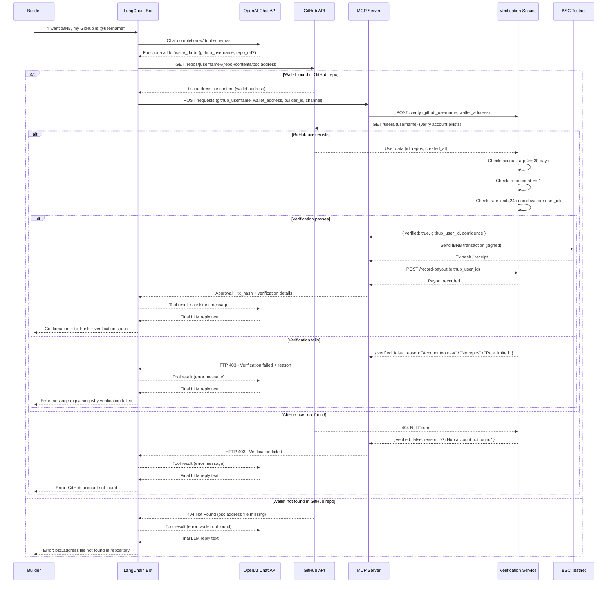

# tBNB MCP

This repository hosts the experimental architecture and prototype services for a Model Context Protocol (MCP) powered faucet experience.

## Services

### Verification Service (`verification_service/`)
FastAPI service that verifies builders via GitHub API with rate limiting.

#### Configure (Optional)
Create `verification_service/.env` to increase GitHub API rate limits:
```env
GITHUB_TOKEN=ghp_your_personal_access_token_here
```

**Getting a GitHub Token:**
1. Go to https://github.com/settings/tokens
2. Click "Generate new token (classic)"
3. Set expiration and check `read:user` scope
4. Copy the token and add it to `.env`

**Rate Limits:**
- Without token: 60 requests/hour per IP
- With token: 5,000 requests/hour

#### Run locally (PowerShell)
```bash
cd verification_service
python -m venv .venv
.venv\Scripts\activate               # Windows PowerShell: .venv\Scripts\Activate.ps1
pip install -r requirements.txt
uvicorn main:app --host 0.0.0.0 --port 8080
```

Test the service:
```bash
curl -X POST http://localhost:8080/verify ^
  -H "Content-Type: application/json" ^
  -d "{\"wallet_address\": \"0x1234\", \"github_username\": \"octocat\"}"
```

Expected response:
```json
{
  "wallet_address": "0x1234",
  "verified": true,
  "confidence": 0.75,
  "reason": "All verification checks passed",
  "github_user_id": 1,
  "repo_count": 8,
  "account_age_days": 5000
}
```

### MCP Server (`mcp_server/`)
FastAPI orchestration layer that validates wallet requests via the verification service and, when approved, submits an actual tBNB transfer via Web3 (BSC testnet by default).

#### Configure secrets
Create `mcp_server/.env` (never commit this) with:
```
BSC_RPC_URL=https://data-seed-prebsc-1-s1.bnbchain.org:8545
TREASURY_PRIVATE_KEY=<raw private key OR 12-word mnemonic separated by commas/spaces>
DEFAULT_PAYOUT_AMOUNT=0.01          # optional, defaults to 0.3
PAYOUT_GAS_LIMIT=21000               # optional
VERIFICATION_SERVICE_URL=http://localhost:8080/verify
```

The server will interpret `TREASURY_PRIVATE_KEY` as a mnemonic when it contains multiple words (commas or spaces). Make sure the wallet has enough tBNB to cover both payouts and gas.

#### Run locally (PowerShell)
```bash
cd mcp_server
python -m venv .venv
.venv\Scripts\activate
pip install -r requirements.txt
uvicorn main:app --reload --port 8090
```

Request a payout:
```bash
curl -X POST http://localhost:8090/requests ^
  -H "Content-Type: application/json" ^
  -d "{\"builder_id\": \"user-123\", \"wallet_address\": \"0x1234\", \"channel\": \"discord\"}"
```

Expected response (tx hash is real on BSC testnet):
```json
{
  "request_id": "UUID",
  "status": "approved",
  "message": "Disbursement submitted to BSC testnet",
  "tx_hash": "0x...",
  "verification": {
    "wallet_address": "0x1234...",
    "verified": true,
    "confidence": 1.0,
    "reason": "Stubbed verification service"
  }
}
```

### LangChain Chat Bot (`langchain_bot/`)
Interactive CLI that role-plays the BNB Support AI. When a builder asks for tBNB, the agent calls the MCP server via a LangChain tool and relays the returned transaction hash.

#### Configure secrets
Create `langchain_bot/.env` with:
```
OPENAI_API_KEY=sk-...
MCP_SERVER_URL=http://127.0.0.1:8090/requests   # or your tunnel URL
```

#### Run locally (PowerShell)
```bash
cd langchain_bot
python -m venv .venv
.venv\Scripts\activate
pip install -r requirements.txt
python chat.py
```

Keep the verification service and MCP server running. Sample session:
```
builder> hey support, can I get tBNB sent to 0x76c9...15ce?
assistant> Payout approved ... tx_hash=0x...
```

## End-to-End Flow (Sequence)


## Verification (Via GitHub)

The verification service performs the following checks:

1. **GitHub Account Exists**: Verifies the GitHub username exists
2. **Repository Count**: Builder must have at least 1 public repository
3. **Account Age**: GitHub account must be at least 30 days old
4. **Rate Limiting**: Each GitHub user can only collect tBNB once per 24 hours

### Database Schema

The verification service uses SQLite to track rate limiting:
- `github_user_id` (INTEGER PRIMARY KEY): GitHub's numeric user ID
- `last_payout_timestamp` (TIMESTAMP): When the user last received tBNB

### API Changes

All requests now require `github_username`:
- **Verification Service**: `POST /verify` expects `github_username` in request body
- **MCP Server**: `POST /requests` expects `github_username` in request body
- **LangChain Bot**: `issue_tbnb` tool now requires `github_username` parameter

### Rate Limiting

Rate limiting is enforced per GitHub user ID (not username), preventing users from bypassing limits by changing usernames. The 24-hour cooldown is checked during verification and recorded after successful payout. 

to prevent users from using multiple repos, the verification service will check in the url, the username, the repos, file name, wallet address and commit hash. data stored in SQL is username, commit hash, wallet address and time stamp.