# tBNB Project Architecture

## Introduction
The project delivers an MCP (Model Context Protocol) server that lets verified builders request and receive 0.3 tBNB directly through BNB AI assistants (Discord, Telegram, web chatbot) without having to front 0.02 BNB on the public faucet.

## Goals and Success Criteria
1. Reduce onboarding friction: verified builders should receive tBNB in a single conversational flow.
2. Preserve anti-abuse protections equivalent to the official faucet.
3. Provide auditable logs for every disbursement and manual override.
4. Make the architecture deployable inside existing BNB Chain support infrastructure.

## Actors & Systems
- **Builder**: verified user requesting tBNB.
- **BNB AI Assistant**: LLM-bound chat entry point (Discord, Telegram, web).
- **MCP Server**: core service that validates wallets, manages quotas, and triggers payouts.
- **Verification Source**: proof that the builder already passed Discord/Telegram verification.
- **Treasury Wallet / Faucet Contract**: holds tBNB and signs transfers.
- **Ledger & Observability Stack**: storage for requests, decisions, and alerts.

## Current Pain Points
1. Builders must preload 0.02 BNB just to qualify for the faucet.
2. The official faucet is difficult to discover from support channels.
3. Verification context is lost when users are redirected from support to the faucet UI.

```mermaid
flowchart TD
    A[Builder opens support ticket] --> B[LLM support replies with faucet link]
    B --> C[Builder visits faucet UI]
    C --> D{Wallet has ≥0.02 BNB?}
    D -- No --> E[Request rejected]
    D -- Yes --> F[0.3 tBNB sent from faucet wallet]
```

## Proposed Architecture

### High-Level Flow
1. Builder engages BNB AI from a verified channel and submits wallet address.
2. MCP server validates wallet ownership, rate limits, and channel verification.
3. Upon approval, the MCP server requests a tBNB transfer from the treasury/faucet wallet.
4. The transaction hash and conversation context are logged.

### Core Components
- **Conversation Adapter**: normalizes Discord/Telegram/web payloads into MCP requests.
- **Eligibility Engine**: enforces verification, wallet sanity checks, abuse heuristics, and per-user quotas.
- **Payout Orchestrator**: wraps the treasury wallet/faucet contract, queues transactions, and monitors confirmations.
- **Audit Ledger**: append-only store of requests, decisions, tx hashes, and metadata for compliance.
- **Monitoring & Alerting**: tracks wallet balances, error rates, and suspicious use (e.g., repeated wallet rotations).

### Data Model (conceptual)
- `ConversationContext`: user handle, channel, verification status, timestamps.
- `WalletRecord`: checksum address, last verified owner, risk score, payout history.
- `Disbursement`: amount, tx hash, gas cost, status, operator overrides.

## Security & Compliance Considerations
- Require signature (or OAuth token) from the verified Discord/Telegram bot to prevent spoofing.
- Rate-limit per channel and per wallet; auto-block wallets failing ownership proofs.
- Keep treasury wallet isolated with hardware key / custodial service; MCP requests should trigger a signer service rather than hold private keys inline.
- Emit structured logs for every decision to support audits and incident response.

## Operational Concerns
- **Scalability**: MCP server should be stateless behind load balancer; state persists in datastore.
- **Reliability**: queue payout requests and retry idempotently if blockchain confirmation is delayed.
- **Observability**: dashboards for request volume, approval ratios, and treasury balance forecasts.
- **Runbooks**: document manual refill of tBNB, incident response when abuse heuristics fire, and disaster recovery of ledger data.

## Open Questions
1. Which verification proofs (Discord role, Telegram token, etc.) should be persisted, and for how long?
2. Do we need explicit consent logging before sending funds to a wallet shared in chat?
3. Who funds and manages the treasury wallet replenishment cadence?
4. Are there jurisdictions requiring KYC/AML checks before dispensing tBNB at this volume?

## Appendix: Diagram Reference
- Problem funnel: see **Current Pain Points** diagram for legacy experience.
- Solution flow: see **Proposed Architecture > High-Level Flow** sequence diagram.